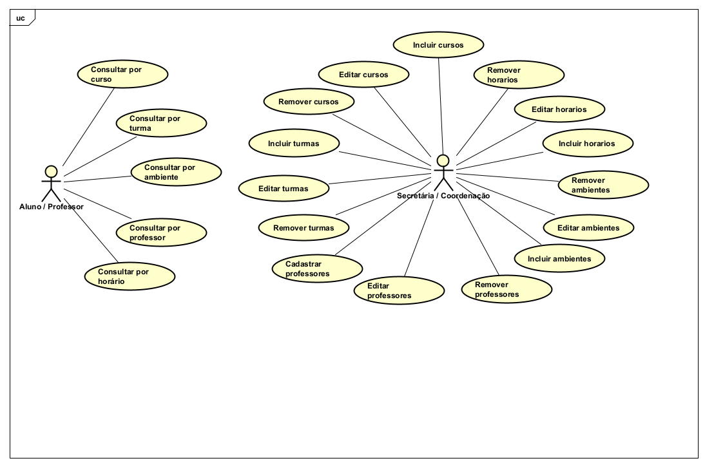

<h1 align="center"> Projeto ABP</h1>

## 
 Equipe: CodeMasters 

| NOME               | FUNÇÃO        | GITHUB                               |
|--------------------|---------------|--------------------------------------|
| Manuela Castro     | Scrum Master  | [manuelalemes](https://github.com/manuelalemes) |
| Gabrielly Neu      | Product Owner | [Gabrielly209](https://github.com/Gabrielly209) |
| Eric França        | Developer     | [Ericfranca90](https://github.com/Ericfranca90) |
| Pedro Claudino     | Developer     | [PehSeasmoke](https://github.com/PehSeasmoke) |
| Marcelo Vinicius   | Developer     | [marcelovmr](https://github.com/marcelovmr) |

 
  
# 
 Descrição do Projeto: 

Para estimular o aprendizado prático e a aplicação de conceitos teóricos, a FATEC de Jacareí desafiou os alunos do 1º semestre do curso de Desenvolvimento de Software Multiplataforma a desenvolverem uma aplicação web utilizando práticas modernas de gerenciamento de projetos. A proposta busca proporcionar uma experiência dinâmica, permitindo que os estudantes criem soluções inovadoras enquanto aprimoram suas habilidades no desenvolvimento de software.

## SPRINTS

| Sprint | Link        | Início      | Entrega     | Status |
|--------|-------------|-------------|-------------|--------|
| 01     | [Sprint 01](#sprint-1) | 24/03/2025  | 15/04/2025  |  ✔    |
| 02     | [Sprint 02](#sprint-2) | 16/04/2025  | 15/05/2025  |  ⏳    |
| 03     | [Sprint 03](#sprint-3) | 16/05/2025  | 11/06/2025  |  ⏳    |

 

Clique [aqui](https://trello.com/invite/b/67e1e9ab2a6046abcba03900/ATTI50b8625e86239662e0d7e83dc56f144eBC72E6FE/projeto-abp) para acessar o quadro do Trello.

  

 

# :page_with_curl: Product Backlog

### REQUISITOS FUNCIONAIS

| REQUISITO FUNCIONAL_ID | REQUISITOS                                                                                                 | SPRINTS |
|------------------------|------------------------------------------------------------------------------------------------------------|---------|
| RF - 1                 | Fazer a ingestão de dados no sistema a partir de uma fonte tal como um arquivo CSV                         | #1 #2   |
| RF - 2                 | (opcional) Fazer o gerenciamento dos dados do sistema (CRUD) através da interface da aplicação, permitindo que a secretaria acadêmica/coordenação altere os dados por meio de uma tela da aplicação |  #3  |
| RF - 3                 | Garantir que o cadastro ou a ingestão de dados satisfaça as regras básicas de alocação da faculdade (ex.: duas turmas diferentes não podem ser alocadas na mesma sala, e um professor não pode ter duas turmas no mesmo horário) | #2   |
| RF - 4                 | Permitir que o sistema exporte relatórios/mapas de ambientes e horários em formato PDF                     |  #3  |
| RF - 5                 | Permitir consultas no sistema (ex.: por turma, turno, professor, data) para apoiar a gestão da faculdade.  |  #2  |

### REQUISITOS NÃO FUNCIONAIS

| REQUISITO NÃO_FUNCIONAL_ID | REQUISITOS                                                                                          | SPRINTS     |
|----------------------------|-----------------------------------------------------------------------------------------------------|-------------|
| RNF - 1                    | Requisito de interface: exibir um mapa de salas com a opção interativa de clicar e visualizar a situação do ambiente (ex. aulas alocadas ao longo dos turnos do dia) |  #1  |
| RNF - 2                    | Garantir que o sistema seja responsivo, mantendo um layout consistente em dispositivos móveis e preservando a arquitetura de informação da interface | #1    |

 

## :file_folder: USER STORIES

 

| ID REFERENCIA | Remetente | Instrução | Finalidade | 
|---------------|-----------|-----------|------------|
| RF - 1        | Cliente   | Eu quero fazer a ingestão de dados acadêmicos de um arquivo CSV | Para que eu possa adicionar várias turmas, professores e horários ao sistema de forma eficiente e sem precisar cadastrar manualmente cada entrada |
| RF - 2        | Cliente   | Eu quero poder adicionar, editar, excluir e visualizar turmas, professores, horários e salas através da interface da aplicação | Para que eu possa facilmente manter e atualizar os dados acadêmicos do sistema |
| RF - 3        | Cliente   | Eu quero que o sistema valide a alocação de salas e horários de acordo com as regras de conflito | Para que eu possa evitar sobrecarga de salas e horários para os professores |
| RF - 4        | Cliente   | Eu quero gerar relatórios de alocação de salas e horários em formato PDF | Para que eu possa facilmente compartilhar e imprimir essas informações para análise e tomada de decisões | 
| RF - 5/RNF - 1| Usuário   | Eu quero fazer consultas e visualizar um mapa interativo das salas de aula | Para que eu possa clicar em cada sala e ver rapidamente a alocação de aulas para cada turno do dia |
| RNF - 2       | Usuário   | Eu quero que a interface seja responsiva e se ajuste corretamente em dispositivos móveis | Para que eu possa usar a aplicação com a mesma facilidade em qualquer dispositivo |

 

## :file_folder: Diagrama de Casos de Usos

 

## :file_folder: Diagrama Entidade Relacionamento (DER)

 

 

 
# :page_with_curl: SPRINT 1

No primeiro momento da Primeira Sprint, o Product Owner definiu junto ao cliente os requisitos de que deseja para a conclusão do projeto e para que os Requisitos Funcionais (RF) e Requisitos Não Funcionais (RNF) sejam elaborados de uma melhor maneira.
Criamos o Backlog List do produto através do Scrum Master junto aos outros membros da equipe, e através Backlog List criamos a Backlog da Sprint 1, definindo assim as tarefas de cada membro da equipe nesta etapa.
Definimos por conseguinte os principais elementos do protótipo das páginas através do Figma. Levantamos ainda, para tal elaboração, o levantamento das informações das quais será exposta no site e elaboração do nosso projeto.

 

## • Sprint Backlog
 

| ID REFERENCIA |Prioridade  | REQUISITO DA SPRINT| Responsável |TAREFA INICIADA | TAREFA CONCLUIDA | 
|---------------|------------|--------------------|-------------|----------------|------------------|
|  RF - 1       | 2 | Estabelecer os elementos essenciais das páginas para o desenvolvimento dos protótipos iniciais | Gabrielly | ✔  | ✔  |
|  RNF - 2      | 2 | Criar os componentes fundamentais com base no Diagrama de Casos de Uso e Diagrama de Classes criado por meio do Astah UML | Eric e Marcelo | ✔  | ✔  |
|  RF - 1       | 3 | Realizar uma reunião para fomentar a inspiração e a criatividade em torno do projeto | Eric  | ✔  | ✔  |
|  RNF - 2      | 1 | Projetar as interfaces no Figma, abrangendo as versões para desktop e mobile | Pedro e Marcelo|  ✔  | ✔  |
|  RF - 5       | 1 | Levantar as informações essenciais que serão apresentadas no site | Pedro   | ✔  |✔  |
|  RNF - 2      | 2 | Definir a harmonia visual do protótipo (como a paleta de cores), garantindo uma experiência suave e intuitiva | Manuela |  ✔  | ✔  |
|  RNF - 1      | 3 | Delimitar as interações e funcionalidades do site por meio do Figma | Manuela  | ✔  | ✔  |
|  RNF - 1      | 4 | Verificar a fluidez da navegação, assegurando uma experiência de usuário primorosa | Gabrielly |  ✔  | ✔  |
|  RF - 1       | 4 | Organizar a documentação no GitHub | Eric e Gabrielly |  ✔  | ✔  |

 
 

### • Burndown Sprint 1
 

 

### • Sprint Retrospective 
 

**1. O que funcionou bem durante o sprint?**

Durante a primeira Sprint, diversos aspectos funcionaram muito bem. Um destaque foi a colaboração da equipe — todos demonstraram comprometimento e trabalharam de maneira alinhada, o que nos permitiu atingir as metas dentro do prazo. A comunicação teve uma melhora notável, assim como a distribuição das tarefas: cada integrante ficou responsável por uma parte específica, mas todas as entregas passaram pela aprovação coletiva. Isso evitou desencontros e garantiu que todos estivessem cientes do andamento do projeto. Além disso, a evolução de aprendizado de todos os membros foi notável, com poucas pessoas, todas precisaram estudar todos os temas para ter um mínimo técnico sobre os assuntos e contribuir para a aprovação final.

 

**2. O que não funcionou tão bem durante o sprint?**

Ao longo da primeira Sprint, surgiram desafios e imprevistos, como a saída repentina de um integrante da equipe, onde um grupo já reduzido, ficou ainda menor. Essa situação exigiu uma reestruturação ágil e eficiente para assegurar a continuidade do projeto e o cumprimento dos prazos estabelecidos. Além disso, como no grupo não havia membro com antecedência na área, o início foi conturbado até o momento que conseguimos realinhas melhor as ideias e objetivos.

 

**3. Quais ações podemos tomar para melhorar no próximo sprint?**
  
É possível revisar e otimizar nossas práticas de desenvolvimento, identificando pontos críticos para melhorias e implementando ajustes quando necessário. Podemos, além disso, aumentar o número de reuniões para evitar possíveis desencontros. Ademais, estudar ainda mais os dispositivos que utilizamos no projeto, para termos um resultado final mais impecável.

 

# 📌 Tecnologias utilizadas:

<img 
    align="left" 
    alt="JavaScript" 
    title="JavaScript"
    width="30px" 
    style="padding-right: 10px;" 
    src="https://cdn.jsdelivr.net/gh/devicons/devicon@latest/icons/javascript/javascript-original.svg" 

